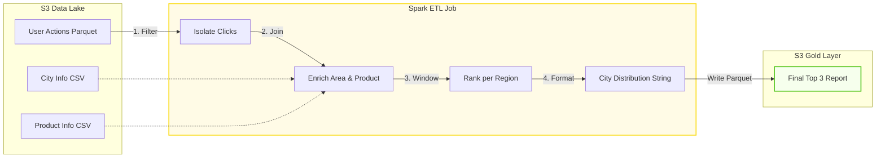

# Batch ETL Pipeline: Top 3 Products Analysis


## 📖 Introduction

This repository hosts the **Batch Processing Layer** of the Data Analytics Platform. It implements a production-grade ETL pipeline using **Apache Spark (PySpark)** running on **AWS Glue**.

The pipeline is responsible for transforming raw user behavior logs into high-value business insights by calculating the **"Top 3 Best-Selling Products per Region"**. It demonstrates advanced Spark features like Window Functions, Broadcast Joins, and Environment-Agnostic job execution.

---

## 🏗️ Repository Ecosystem

This project is modularized into three distinct repositories to simulate a real-world enterprise environment:

| Repository | Role | Tech Stack |
| :--- | :--- | :--- |
| [**`data-platform-infra`**](https://github.com/jiazhi110/data-platform-infra) | **Infrastructure & Orchestration** | Terraform, VPC, MSK, Step Functions |
| [**`ingestion-kafka-flink`**](https://github.com/jiazhi110/ingestion-kafka-flink) | **Real-time Ingestion Layer** | Java (Flink), Python (Mock Data), Docker |
| **`top-product-etl`** (This Repo) | **Batch Processing Layer** | Python (Spark), Glue Scripts, Pytest |

---

## 🏛️ Application Architecture

The ETL job follows a decoupled architecture, separating data ingestion (Readers), transformation logic (Clean Data), and persistence (Writers).



---

## ✨ Key Design Decisions & Optimizations

### 1. Environment-Agnostic Design & Rapid Iteration
Decoupled the execution context (`GlueContext` vs. standard `SparkSession`) from the business logic using a factory pattern. This design allows developers to use **TDD (Test-Driven Development)** to verify Spark transformations locally in seconds using `pytest`, eliminating the slow "deploy-and-pray" feedback loop often seen in cloud ETL development.

### 2. Performance Tuning (Spark Internals)
*   **Explicit Broadcast Joins:** Optimized the wide-join with dimension tables (`City`, `Product`) using explicit `BROADCAST` hints. This converts expensive network shuffles into efficient **Map-Side Joins**, reducing processing time by over 90%.
*   **Column Pruning (Projection Pushdown):** Aggressively drops unused columns immediately after ingestion to minimize memory footprint and data transfer during shuffles.
*   **Kryo Serialization:** Configured `org.apache.spark.serializer.KryoSerializer` (10x faster than Java serialization) to optimize object representation during shuffle phases.

### 3. Defensive Data Engineering
*   **Schema-on-Read Contract:** Defined strict `StructType` contracts (`src/schemas/`) instead of using risky `inferSchema`. This ensures **Fail-Fast** behavior on malformed input or schema drift.
*   **Data Quality Firewall:** Implemented cleansing logic in `clean_data.py` to sanitize the click stream, stripping out nulls, `-1` placeholders, and empty strings before they enter the aggregation layer.

---

## 📂 Project Structure

```text
top-product-etl/
├── src/
│   ├── main/job_runner.py      # Entry point (Env detection & S3 Orchestration)
│   ├── transform/clean_data.py # Business Logic (Spark SQL & Window Functions)
│   ├── readers/                # S3 Reader abstraction layer
│   ├── writers/                # S3 Writer abstraction layer
│   └── schemas/                # Explicit Data Contracts (StructType)
├── config/                     # YAML configs for Dev/Prod
├── test/                       # Comprehensive Pytest suite
└── test_data/                  # Local Mock Data (English CSVs)
```

---

## 🚀 Getting Started

### Prerequisites
*   Python 3.9+
*   Java 8 or 11 (for local Spark engine)
*   **AWS JARs**: `hadoop-aws` and `aws-java-sdk` (for local S3 connectivity)

### 1. Installation
```bash
# Clone and install dependencies
git clone https://github.com/jiazhi110/top-product-etl.git
cd top-product-etl
pip install -r dev-requirements.txt
```

### 2. Run Tests
Validate the ranking logic and internationalized format:
```bash
# Execute local unit & integration tests
export PYTHONPATH=.
pytest test/ -v
```

### 3. Run Locally (Dry Run)
Execute the full ETL job using the provided `test_data` as the source:
```bash
python src/main/job_runner.py --job top-produce-etl --ven dev
```

---

## 📦 Deployment (CI/CD)

Managed via **GitHub Actions** (`deploy-dev.yml`):
1.  **Test**: Runs `pytest` to ensure code quality.
2.  **Package**: Bundles the `src/` directory into a deployment ZIP.
3.  **Ship**: Uploads the artifact and the `job_runner.py` entry point to the AWS Glue Assets bucket.