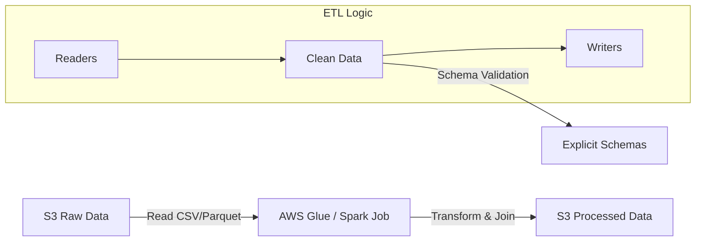

# Data Architecture & ETL Workflow

## Overview
This document describes the high-level architecture of the **Top Produce ETL** pipeline. The system is designed to process large-scale user behavior data to identify top-performing products across different regions.

## Data Flow Diagram (Conceptual)

## Workflow Steps

### 1. Ingestion (Source)
Data is ingested from AWS S3. The source data consists of:
*   **City Info**: Reference data (CSV) containing city and region metadata.
*   **Product Info**: Reference data (CSV) containing product details.
*   **User Action**: Transactional data (Parquet) representing user clicks and interactions.

### 2. Transformation (AWS Glue / Spark)
The core logic resides in `src/transform/clean_data.py`. Key steps include:

*   **Schema Enforcement**: explicit schemas (`src/schemas/`) are applied on read to ensure strict data quality.
*   **Filtering**: Only 'click' events are retained using optimized filter conditions.
*   **Enrichment**: Transaction data is joined with City and Product dimensions to add context (Area Name, Product Name).
*   **Aggregation**: Top 3 products are calculated per region (Area) using Window functions to handle ranking.

### 3. Storage (Target)
The result is written back to S3 in **Parquet** format. This format is optimized for downstream analytics tools like **Amazon Athena** or **Redshift Spectrum**.

## Infrastructure & DevOps
*   **Infrastructure as Code**: The Glue Job and related S3 buckets are provisioned via **Terraform** (managed in a separate repository).
*   **CI/CD**: Deployment is automated via **GitHub Actions** (`deploy-dev.yml`).
    *   Code push -> Unit Tests -> Package -> S3 Upload -> Glue Job Update.

## Directory Structure Strategy
*   **`src/`**: Logic source code.
*   **`config/`**: Environment-specific configurations (decoupled from code).
*   **`schemas/`**: Data contracts.
*   **`test/`**: Quality assurance via Pytest.
